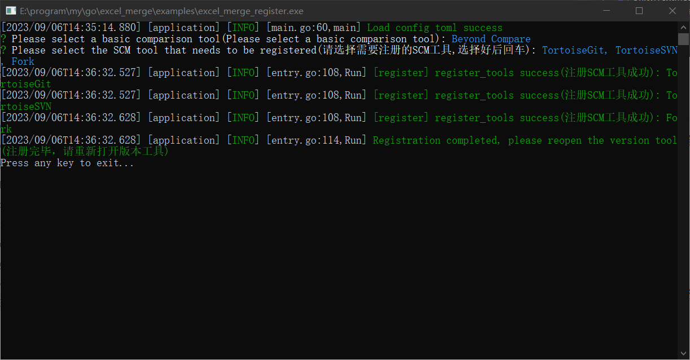
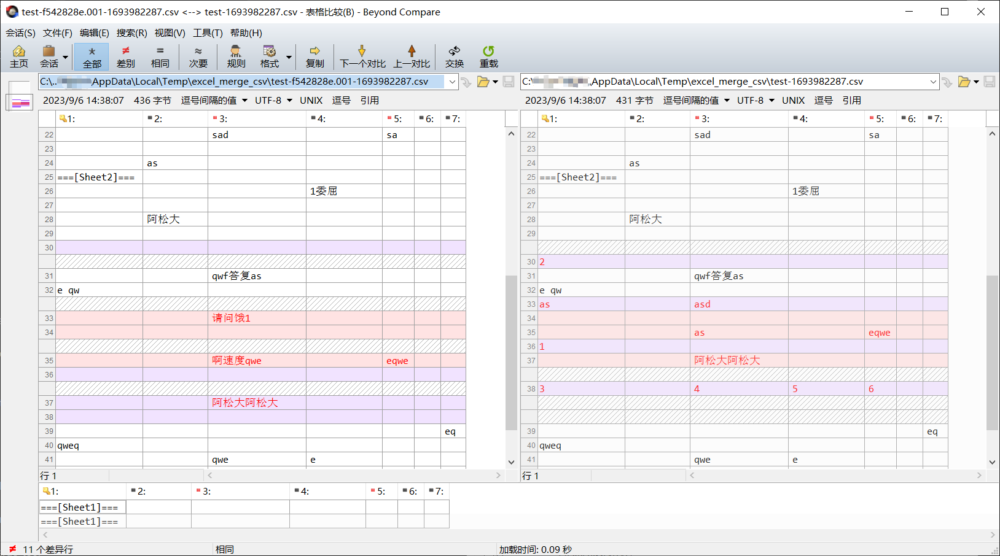
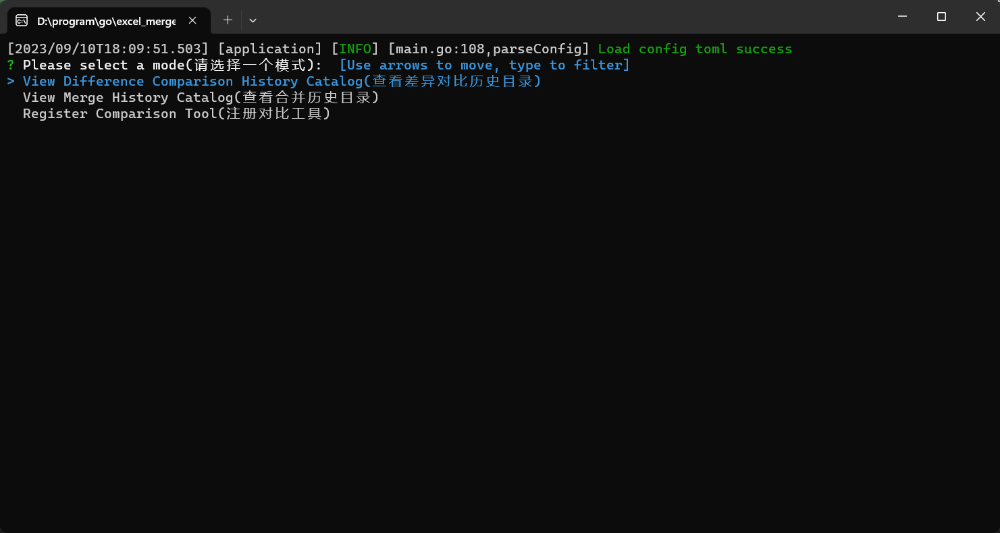

# excel_merge
excel merge diff tools，excel对比合并工具，把excel转成csv格式，然后调用像`Beyond Comapre`第三方工具来对比以及合并。合并之后会把csv数据写回excel这样就能完成excel合并

### 支持功能

- 支持xlsx、xlsm、xls
- 支持excel对比diff模式，支持多Sheet
- 支持excel合并merge模式，支持多Sheet
- 支持作为TortoiseSVN和TortoiseGit以及其他能够自定义对比工具的版本控制软件，如果对比的不是excel文件，会直接调用对比工具。

## 设置方法

### windows

双击打开执行文件，允许权限（用于读取和修改注册表，只需要一次）

1. 选择基础的对比工具之后回车确定，如果有安装`Beyond Comapre`或者使用绿色版注册了右键菜单都会识别出来

   

2. 选择需要注册的scm版本工具，空格选择，回车确定，默认全选

   

3. 注册完成，任意键关闭

   

## 使用方法
- 设置好之后就可以正常使用了，默认使用csv方式，也支持txt，可以在exe同级的config.toml文件中修改，比较示例如下：

- 合并基本同理，默认使用txt模式，就是正常的文本合并，合并完选择基础的excel文件，然后写回excel文件中

- 可以查看历史记录，通过上述设置好之后，第二次打开会进入选择模式，可以选择查看历史记录目录

  

## TODO

- excel合并保留更多格式数据。
