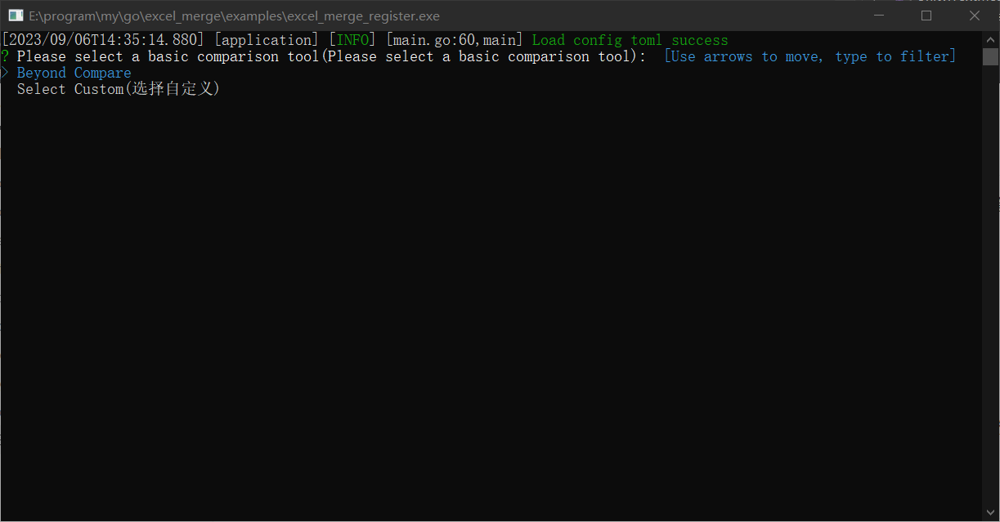
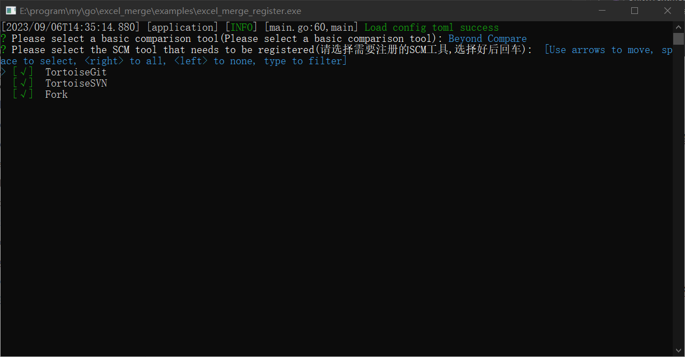

# excel_merge
excel merge diff tools，excel对比合并工具，把excel转成csv格式，然后调用像beyond compare第三方工具来对比以及合并。合并之后会把csv数据写回excel这样就能完成excel合并

### 支持功能

- 支持xlsx、xlsm、xls，支持多Sheet
- 支持excel对比 diff
- 支持excel合并 merge
- 支持作为TortoiseSVN和TortoiseGit以及其他能够自定义对比工具的版本控制软件，如果对比的不是excel文件，会直接调用对比工具。

## 使用方法

### windows

双击打开执行文件，允许权限（用于读取和修改注册表）

1. 选择基础的对比工具之后回车确定，如果有安装Beyond Comapre会识别出来

   

2. 选择需要注册的scm版本工具，空格选择，回车确定，默认全选

   

3. 注册完成，任意键关闭

   

   4. 就可以正常使用了，比较示例如下，合并同理：

      

## TODO

- excel合并保留更多格式数据。
